# Portfolio Projesi Kurulum ve Kullanım Dokümantasyonu

## Proje Hakkında

Bu proje, kullanıcının portfolyosunu modern ve profesyonel bir şekilde sergilemesini sağlayan bir web sitesidir.

- Frontend: Next.js
- Backend: Next.js API Routes (ayrı sunucu yok)
- Veri: JSON dosyaları + GitHub API
- Tasarım: Minimal, responsive, akıcı animasyonlu UI

## Kurulum

### İletişim Mesajları

İletişim mesajları alabilmek için [Resend](https://resend.com/) platformunu kullandım kullanıldı.

- [Resend](https://resend.com/) platformunda kayıt olun.
- API Keys sekmesine gidin
  
  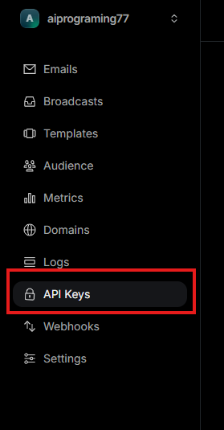
- Yeni bir api anahtarı oluştur
  
  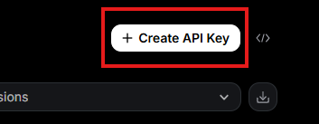
- İstediğiniz ismi girerek `Add` buttonuna tıklayarak yeni api anahtarınızı oluşturun
  
  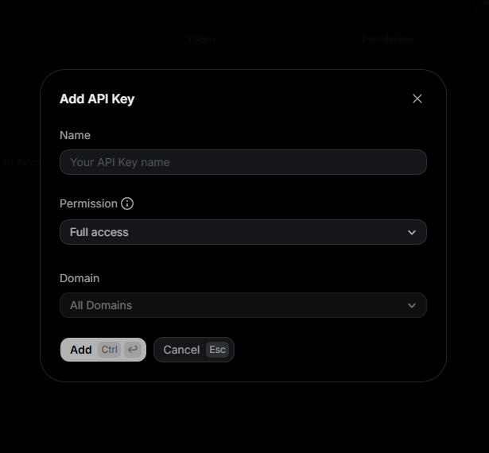
- Verilen api anahtarını kopyalayarak biraz sonra oluşturacağımız `.env.local` dosyasına yazılacak.
  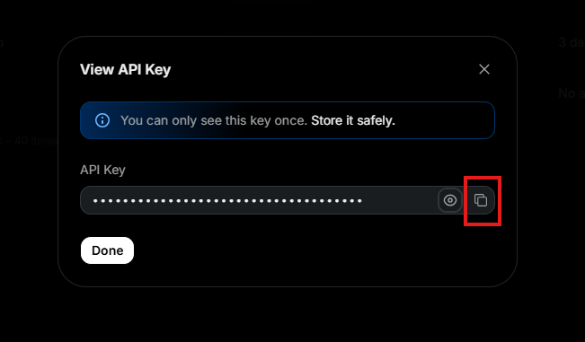

### Projeyi Github'a Yüklemek

- İlk adım [Github](https://github.com) platfomunda kayıt olun.
- Yeni bir depo oluşturun:
  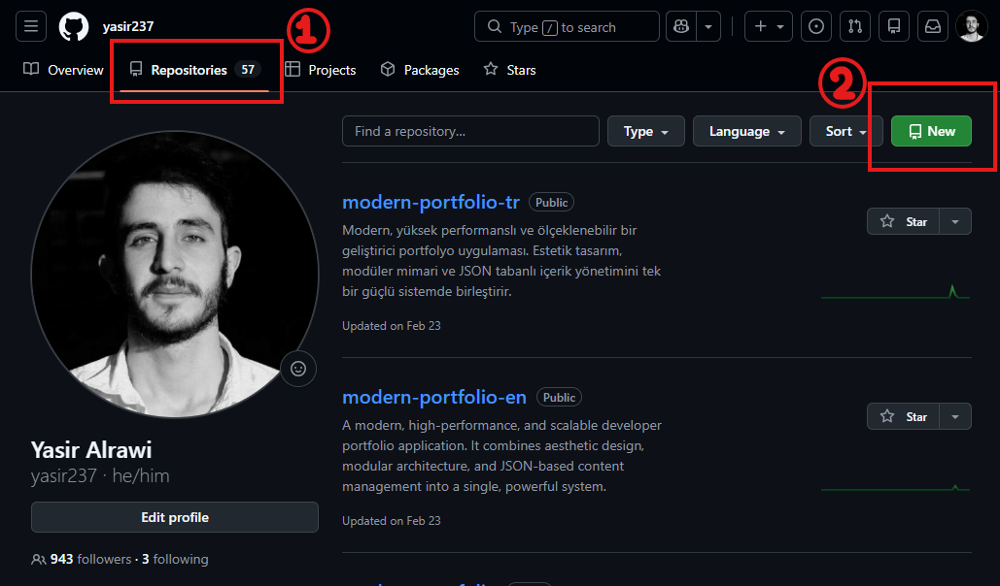
- depo ismini istediğinizi girin, görünürlüğü public yapın, yeni repoistory oluşturun
  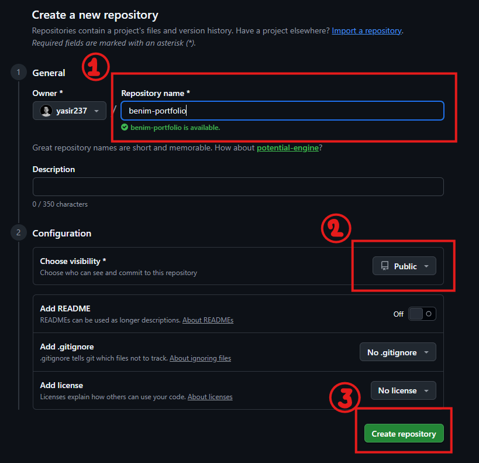
- Projeyi yüklemek için bu seçeneğe tıklayın
  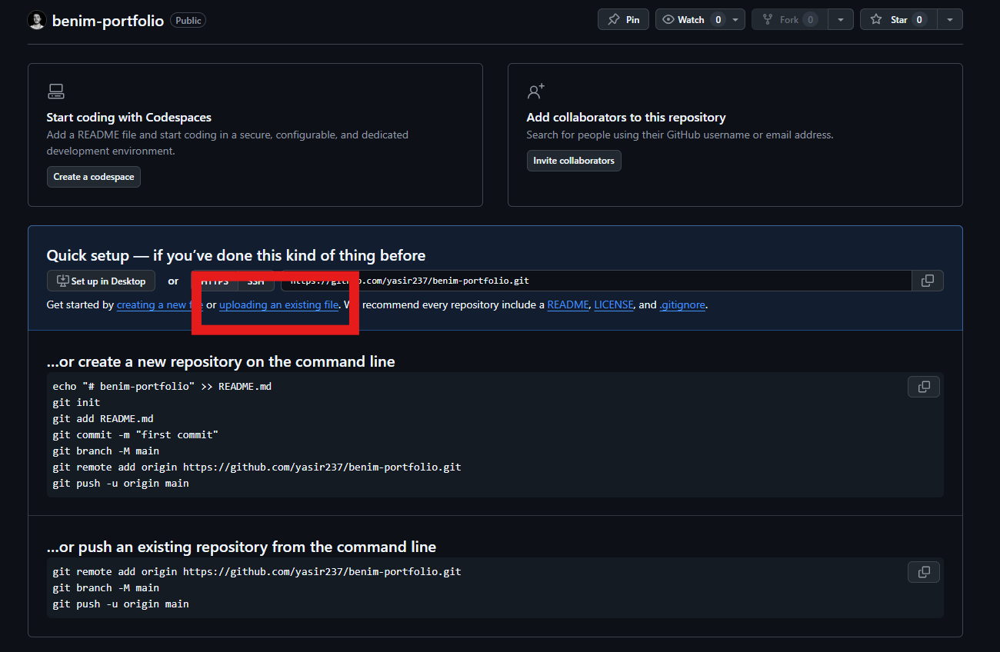
- Önününze bu ekran gelmiş olmalı
  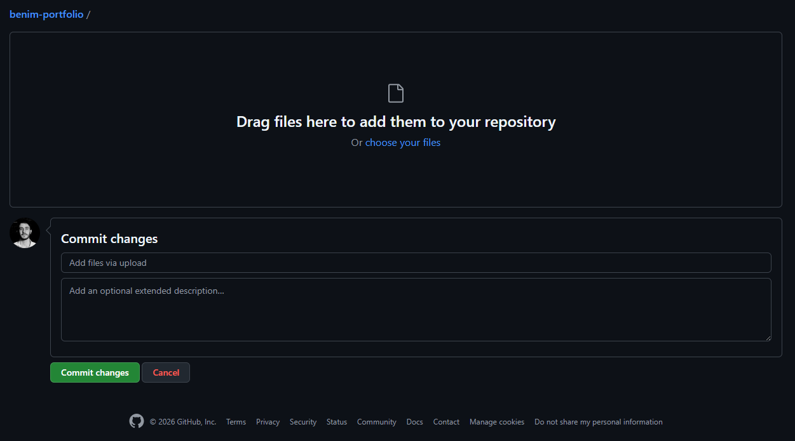
- İndirdiğiniz proje dosyasını ayıklayın
  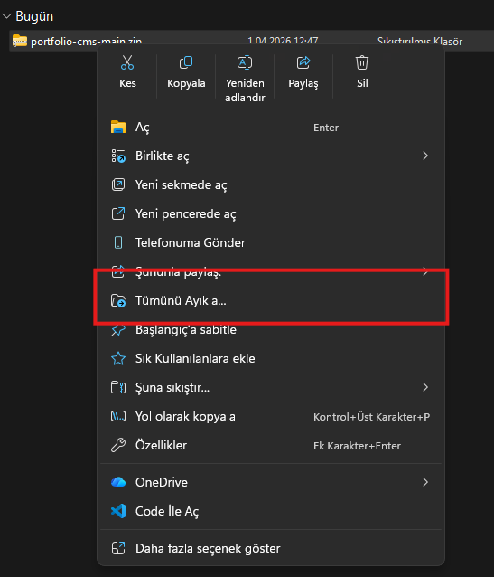
  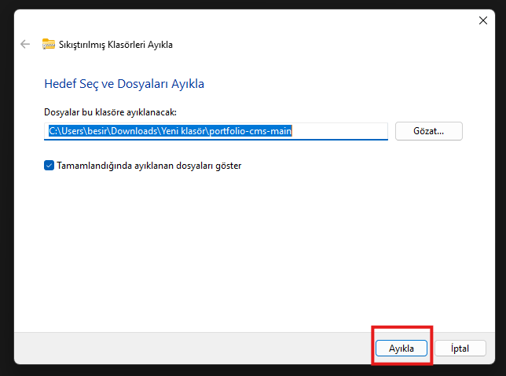
- Yeni çıkarılan klasörün içine girin ve tüm dosyaları görüntüleyin
  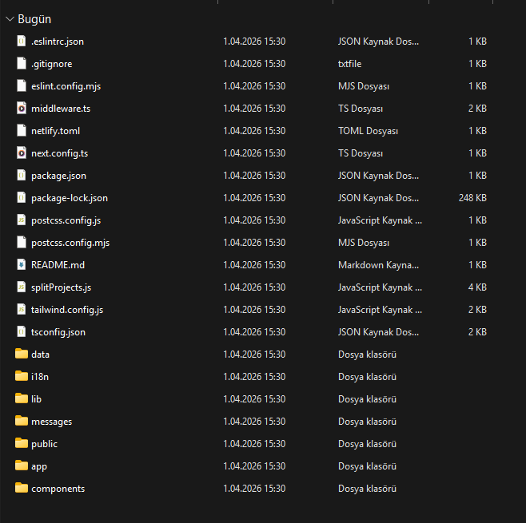
- Biraz önceki github ekranına dönün ve proje dosyları yükleyin
    <video width="600" controls>
        <source src="proje-yukle.mp4" type="video/mp4">
    </video>
- Commit buttonunu tıklayın
    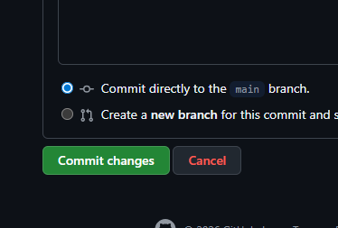
- Son ekran görünüşü bu şekilde olmalı, tüm dosyalar yüklü hali
    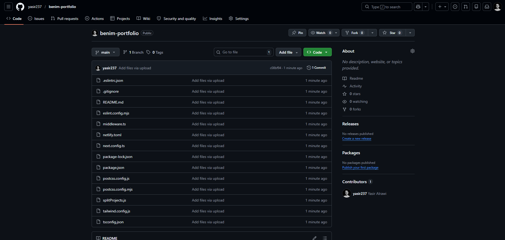

### Github Tokeni Almak
- Github ayarlarına gidin
    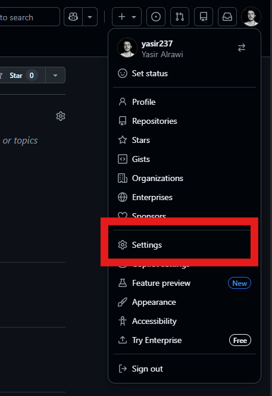
- Sol menüsündeki seçeneklerin arasında `Developer Settings` tıklayın
    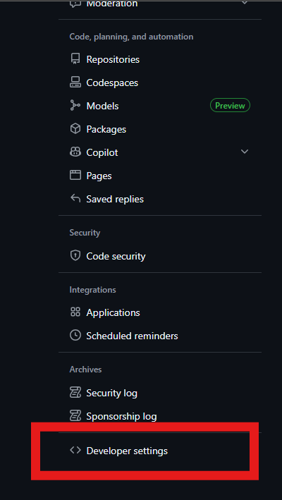
- Yeni çıkan seçeneklerin arasından `Personel access tokens` seçeneğin altındaki `Tokens (classic)` seçeneğini seçin
    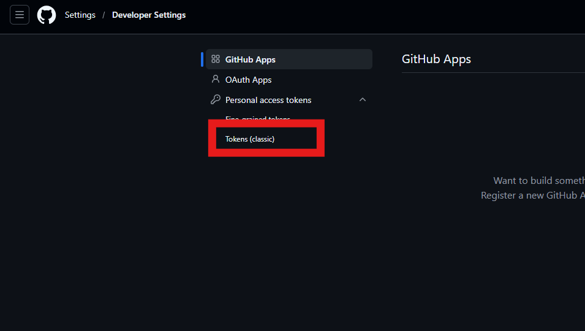
- Yeni token oluşturmak için `Generate new token` buttonuna tıklayın
    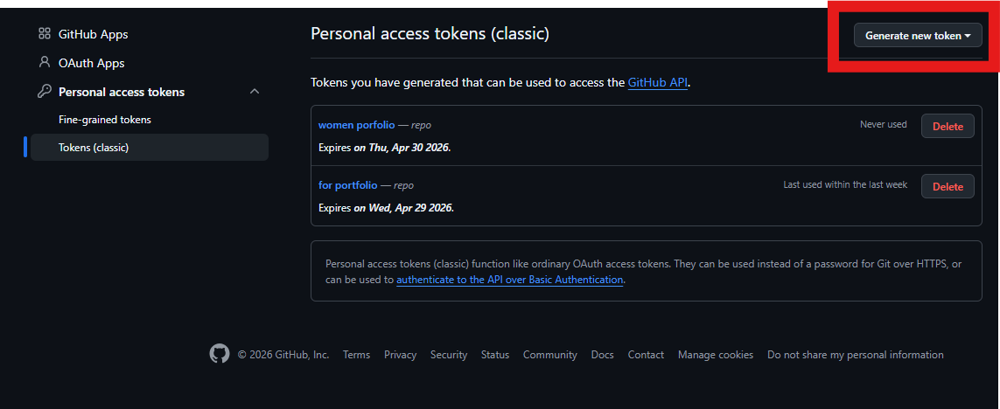
- Çıkan seçeneklerin arasından `Generate new token (classic)` seçeneğini seçin
    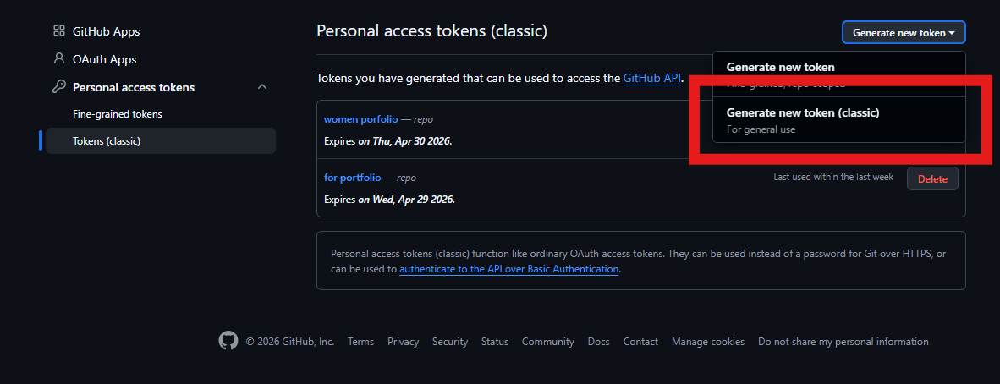

- Note kısmına istediğinizi yazın ve aşağıdaki sadece repo seçeneğini seçin
    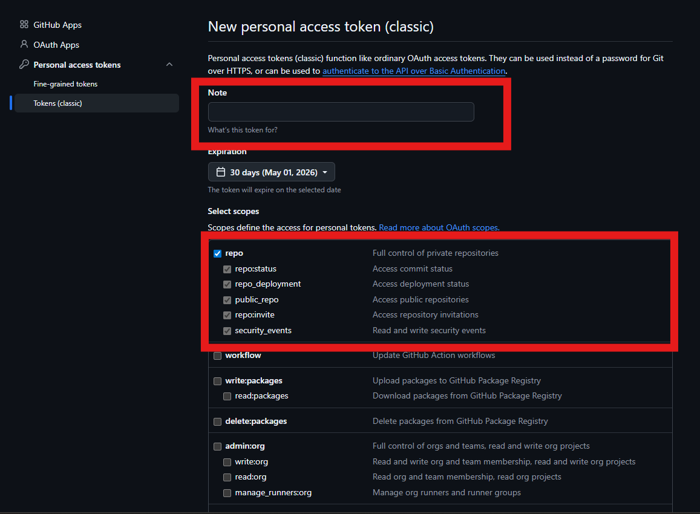
    
- Son kullanım tarihi olarak son seçeneği olan `No expiration` seçeneğini seçin
    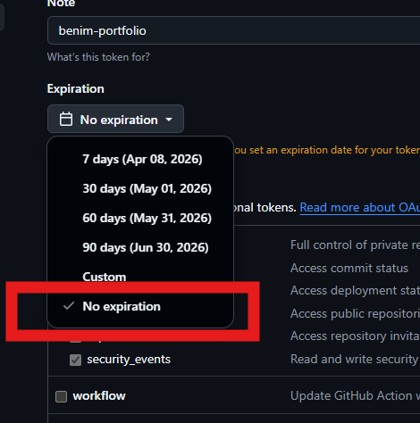
- En aşağıdaki olan `Generate new token` buttonuna tıklayın
    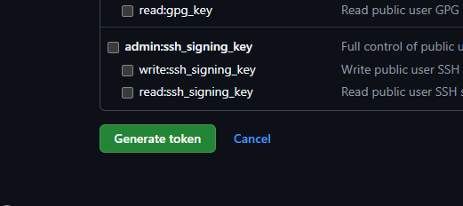
- Size verilen tokeni kopyalayın ve kimseyle paylaşmayın
    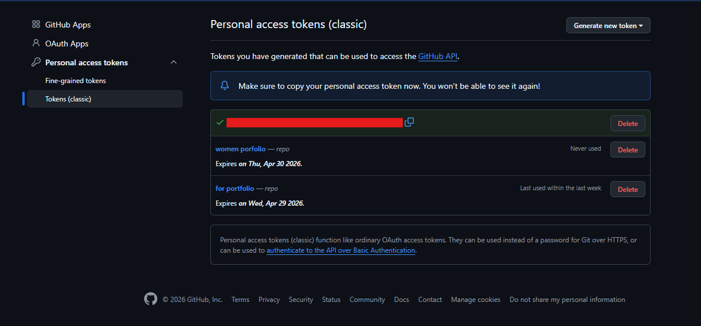

### Resend ve Github API Bağlamak
- Projenizde yeni bir dosya oluşturun ve adını `.env.local`olarak adılandırın
    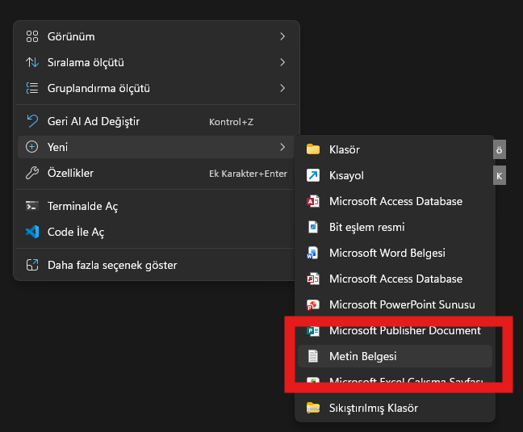
    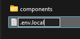
- Oluşturulan `.env.local` dosyasını not defteri kullanarak açın.
- Paneli bağlamak için bunları doldurun parantezlerin arasında yazmayın
    ```txt
    ADMIN_USERNAME=[panele giriş yapmak için kullanılacak kullanıcı adı]
    ADMIN_PASSWORD=[panele giriş yapmak için kullanılacak şifre]
    ADMIN_SECRET=[panelin güvenliği için kullanılacak 32 haneli anahatar]
    ```

    örneğin:
    ```txt
    ADMIN_USERNAME=admin
    ADMIN_PASSWORD=sifre123
    ADMIN_SECRET=kgmshy478b7aslp00hnmx65f44dso91h
    ```

- Resend platformundan aldığımız anahtarı ve kayıt olduğumuz e-postayı aşağıdaki gibi de yazın
```txt
RESEND_API_KEY=[İletişim mesajları almak için aldığın anahtarı]
CONTACT_EMAIL=[İletişim mesajları almak istediğin e-postaya]
```
- Son olarak Github'a bağlamak için bu bilgilere ihtiyacımız var:
    - Biraz önce aldığımız token
        
    - Github hesabınızın kullanıcı adı
        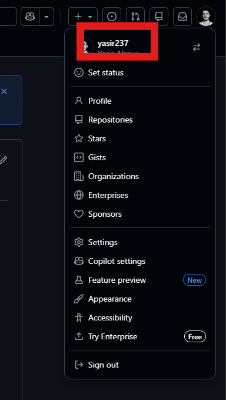
    - Projeyi yüklediğimiz repo adı
        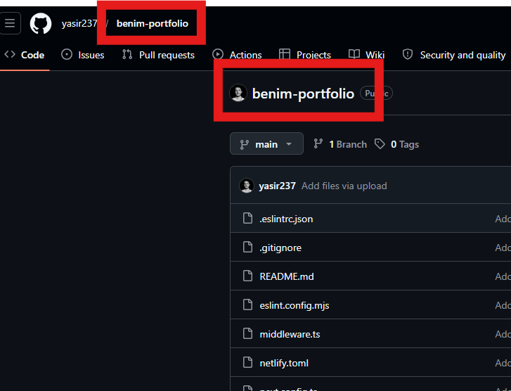
    - branch oda genelde `main` olur
        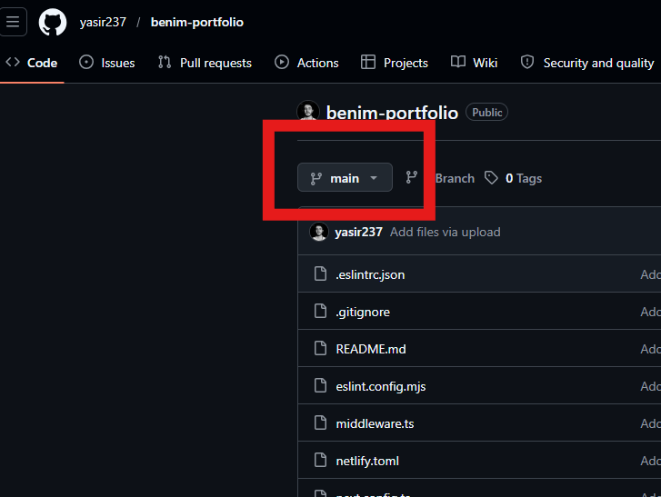
- bu bilgileri aşağıdaki gibi `.env.local` dosyasına yazılacak
```txt
ADMIN_USERNAME=[panele giriş yapmak için kullanılacak kullanıcı adı]
ADMIN_PASSWORD=[panele giriş yapmak için kullanılacak şifre]
ADMIN_SECRET=[panele giriş yapmak için kullanılacak gizli anahatar]


RESEND_API_KEY=[İletişim mesajları almak için aldığın anahtarı]
CONTACT_EMAIL=[İletişim mesajları almak istediğin e-postaya]

GITHUB_TOKEN=[aldığınız github tokeni]
GITHUB_OWNER=[github hesabın sahibinin kullanıcı adı]
GITHUB_REPO=[depolama yapacağın github repo]
GITHUB_BRANCH=[hangi branch üzerinde yapacaksın, genelde main yazılır]
```


## Projeyi Lokal Çalıştırma

- Gerekli paketleri indirmek için bu komut terminalde çalıştırılacaktır

```bash
npm install
```


- Projeyi çalıştırmak için
```bash
npm run dev
```

- Projeyi tarayıcıda açmak için bu url kullan
```bash
http://localhost:3000/
```

- Dil olmadığında dolayı `404` hatasını göreceksiniz
- Yeni dil eklemek için `admin paneli`'ine girmeniz gerek
- Admin paneline girmek için url'dan sonra `/admin` eklemeniz gerek, yani:
    ```bash
        http://localhost:3000/admin
    ```
- Admin panelindeki yan seçeneklerden `Dil Yönetimi` seçeneğini seçin
- Sekmeden boş bir dil ekleyerek siz doldurabilirsiniz veya hazırladığım [diller](https://github.com/yasir237/portfolio-languages) sayfasından dil dosyasını indirerek projenize yükleyebilirsiniz.

